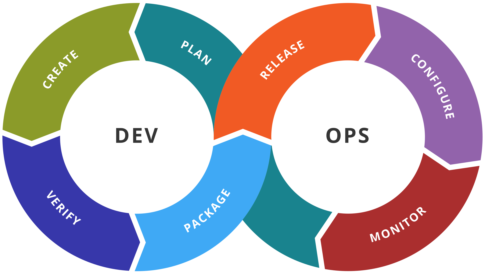

# IaaC-notes

# Some advance stuff you might find handy then you are doing your IaC

Input varialbles 
variable "resource_sensitive" {
    type = object({
        name = string
        attrib1 = string
    })
    sensitive = true
}

resource "some_resource" "x" {
    name = var.user_info.name
    somethingsomething = var.resource_sensitive.address
}

### This is the sample of heading 3

	`terraform fmt`

    [Google](https://www.google.com)

    
